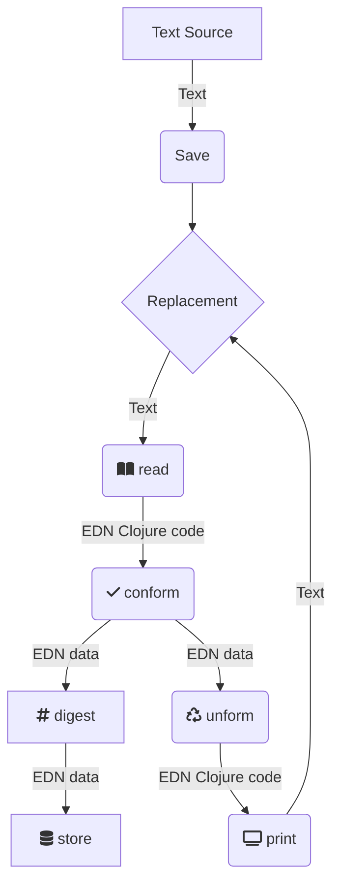

# conformance
Import and persist conformed data to replacement.

## TODO List

### Parsing / ingestion
- Design fundamental units of data
  - [ ] def
  - [ ] defn
  - [ ] defmacro
- Parse bodies to obtain calls to global vars and local references
  - Core binding types
    - [ ] let
    - [ ] for
  - Expressions
    - [ ] s-exp

### Database
- [ ] Save data units to XTDB
- [ ] Query data to demonstrate state history backwards from a given point in time (ancestors)
- [ ] Query data to demonstrate state history forwards from a given point in time (descendants)

# Documentation

This is where we tackle the long tail problem of how to ensure that as much data as possible can be imported to replacement in a meaningful form.

By meaningful we mean that it conforms to a spec and that the conformer of that spec will provide data that can be round-tripped.

The flow is like this:



**RE**ad **C**onform **U**nform **P**rint aka the RECUPeration workflow

If the text source can listen, it will be given back the same text as input with the assurance that it conformed and was persisted.

# Testing

```bash
clojure -X:clj-test
```
# Development

## XTDB
We use XTDB as library. Check the docs here
